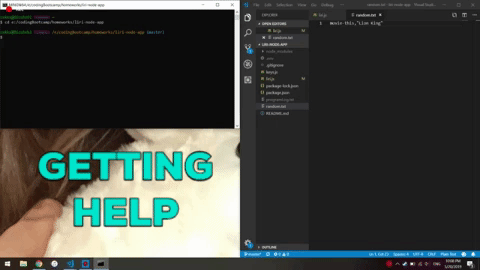
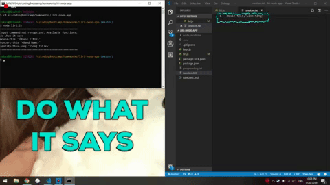
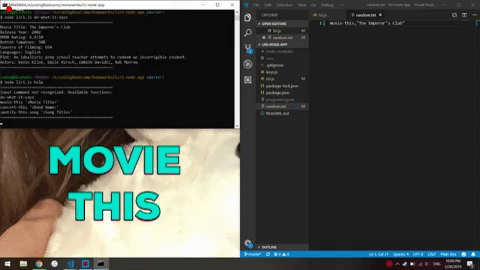
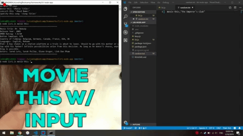
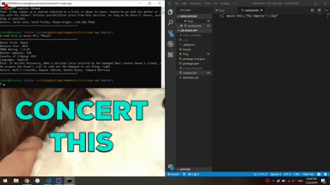
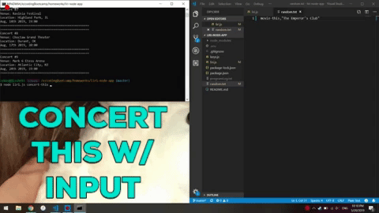
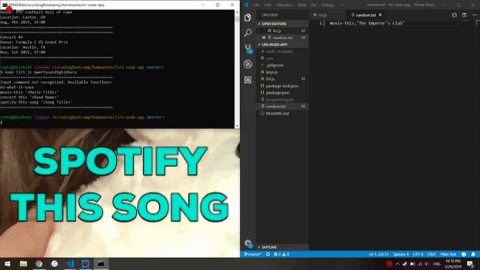
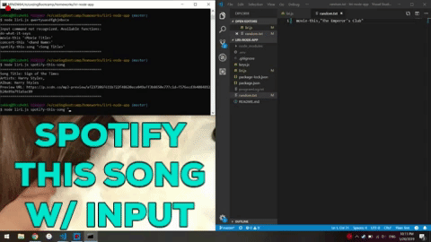

# liri-node-app
A Language Interpretation and Recognition Interface utilizing Node.js

# Specifications:
LIRI searches Spotify, Bands in Town, and OMDB using Axios, or other methods for these APIs.  
Used Node for: Node-Spotify-API, Axios (OMDB, Bands In Town), Moment, DotEnv, FS  

# Using this Application
This application has four different functions written into it. It can access the Spotify, OMDB, and Bands In Town APIs using three seperate commands, and can utilize basic instructions from a textfile named random.txt  
If at any point you forget how to call the different functions, you may simply call `node liri.js` in the command line and it will display the four different options available. Those are as follows, with guidelines attached:  
  
`node liri.js do-what-it-say`: This functionality takes in arguments from a text file random.txt and runs whatever request is in that txt file. The requests it can run are the three following commands.  
  
`node liri.js movie-this <"Movie Name">`: This functionality takes in an optional argument, the movie name in quotations, and returns the OMDB response and some choice statistics about the movie.  
  
`node liri.js concert-this <"Band Name">`: This functionality takes in an optional argument, the band's name in quotations, and returns the Bands In Town response indicating the venue, location, and date of the upcoming concert.  
  
`node liri.js spotify-this-song <"Song Name">`: This functionality takes in an optional argument, the song's name, and returns the Spotify response for their closest match.  
  
This application also provides a programLog.txt file the logs each step taken and what arguments were given. It does not store responses, although I can update with that functionality if desired.

Video Walkthrough of Application:
https://youtu.be/u7SA5ToJJS0